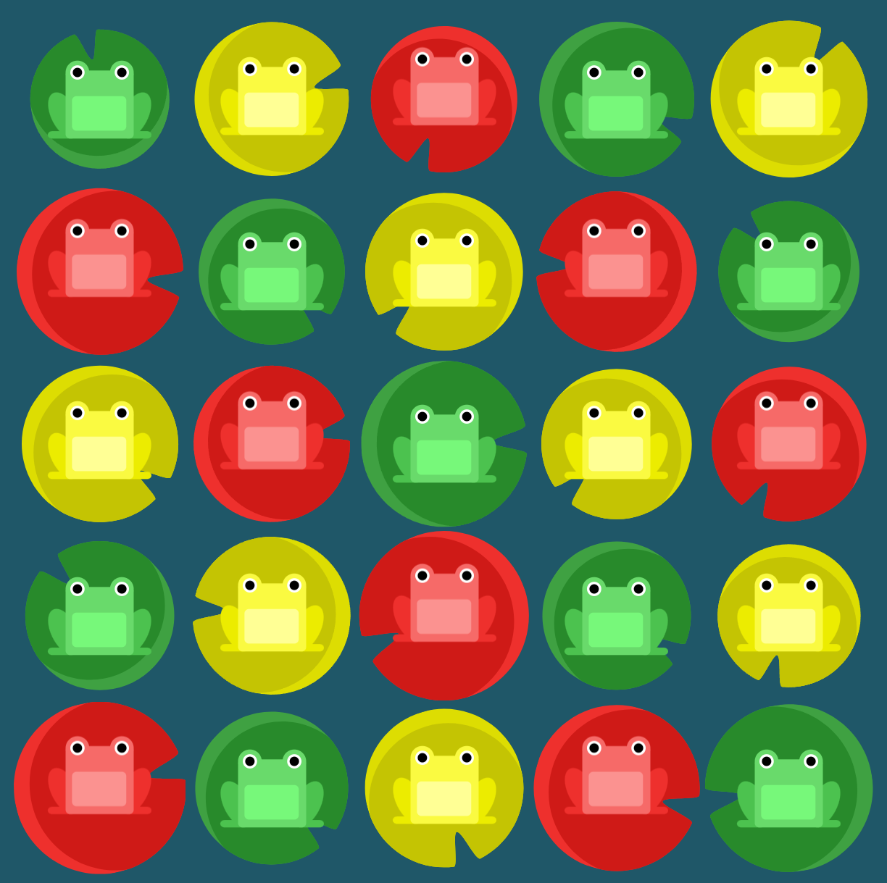
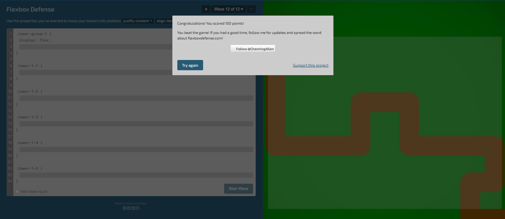
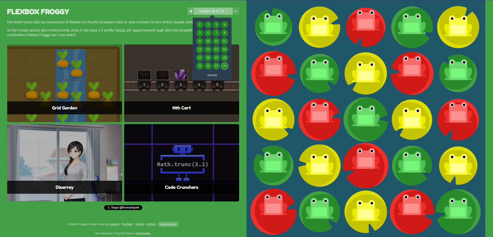

Sesto Esercizio Classe #137 - Boolean
===
Studente: Fabio Ferrero

---
# English

## Target of the project:
Complete the minigames at links: 
- http://www.flexboxdefense.com/
- https://flexboxfroggy.com/
---
# Italiano

## Obiettivo del progetto:
Completare i minigame ai link: 
- http://www.flexboxdefense.com/
- https://flexboxfroggy.com/

---

---

---
<strong>Gli screenshot del completamento sono i seguenti:</strong>

